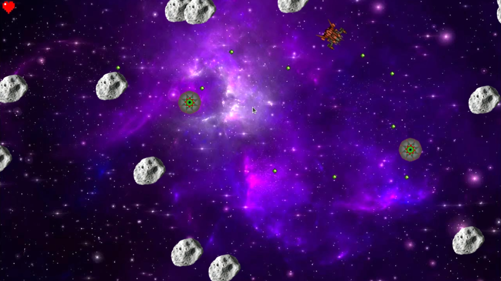

# Space Shooter Galaxy Game

**Space Shooter Galaxy** is an arcade-style space shooter game where the player controls a spaceship to shoot down incoming waves of enemies and asteroids. The game features a health bar, score counter, and various enemies with different mechanics. The objective is to survive as long as possible, destroying enemies while avoiding damage.

 <!-- Update this path based on where you store the image in your repo -->

# How to run the game on a Pi

* Install the following dependencies:
   - SDL dev `sudo apt-get install libsdl2-dev`
   - SDL image dev `sudo apt-get install libsdl2-image-dev`
   - SDL mixer dev `sudo apt-get install libsdl2-mixer-dev`

* After installing dependencies, run `make` from the root folder.
* To start the game, run `./game`.

# Game Features and Status

### Game UI - Start screen Acceptance tests

* "The user can view the high score board by clicking the high score board option."
   * Currently, the high score screen is not implemented, so the score button will bring the user to a blank screen.

### Game UI - Health bar, Score counter, Wave tracker Acceptance tests

* "Player score increases when an enemy is killed."
   * Score system not implemented yet, so this will not show.
* "Wave counter should increment when a wave finishes."
   * Wave system not implemented yet, so this will not show.

### Game Mechanic - Player/sprite that can move and shoot Acceptance tests

* When an enemy takes damage, it is not visible to the user until the damage is enough to kill the enemy.

### Closed Stories

- Game UI - Start Screen
- Game Mechanic - Player/sprite that can move and shoot
- Game Mechanic - AI enemies and asteroids
- Game Audio - Sound Effects
- Game Audio - Music (Optional Feature)
